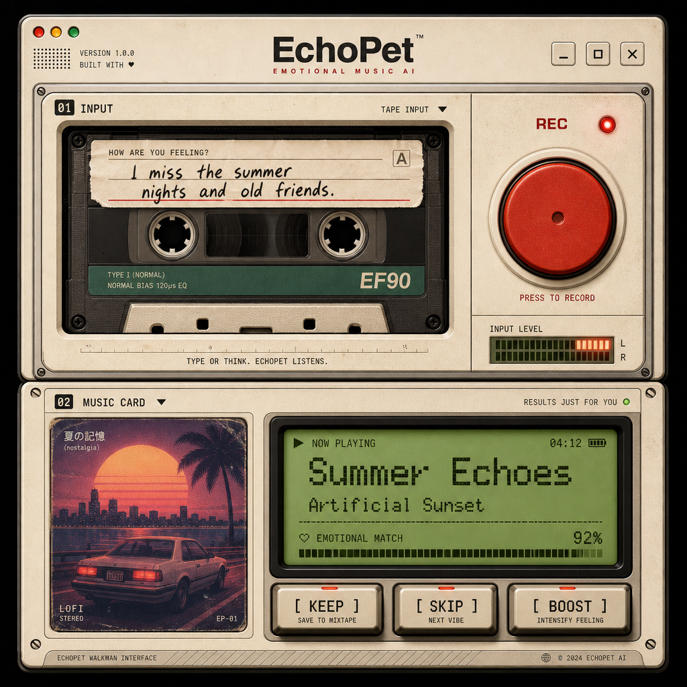
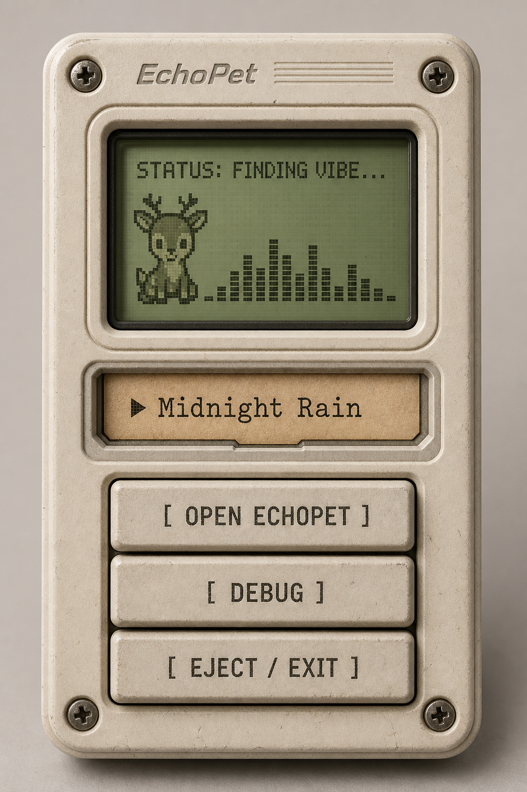

# EchoPet

> Not just music. A companion that understands your moment.
>
> 不只是音乐，而是懂你此刻状态的桌面音乐伙伴。

EchoPet 是一个本地优先的桌面情绪音乐 Agent。它把 DyberPet 桌宠、语音输入、环境上下文、长期记忆和本地曲库推荐连接起来：用户不需要打开音乐软件反复搜索，只要对桌宠说一句“我现在有点烦”或“我想专注一下”，EchoPet 会理解当下状态，并从本地音乐库里推荐更适合此刻的音乐。



## Contents

- [What It Does](#what-it-does)
- [Why EchoPet](#why-echopet)
- [Product Experience](#product-experience)
- [Architecture](#architecture)
- [Tech Stack](#tech-stack)
- [Quick Start](#quick-start)
- [Music Library](#music-library)
- [Configuration](#configuration)
- [Development](#development)
- [Troubleshooting](#troubleshooting)
- [Project Structure](#project-structure)
- [Roadmap](#roadmap)

## What It Does

EchoPet 的核心不是“播放一首歌”，而是理解用户为什么此刻需要音乐。

| Capability | Description |
| --- | --- |
| Desktop companion | 基于 DyberPet 的桌宠形态，常驻桌面，低打扰、轻交互。 |
| Text and voice input | 支持文本输入，也支持录音后通过 faster-whisper 转写。 |
| Context awareness | 结合时间、活跃应用、键盘节奏等弱信号判断用户场景。 |
| Emotion and intent analysis | 将用户表达转成当前状态、需求和音乐检索意图。 |
| Local music recommendation | 扫描本地曲库，用真实音频特征和 embedding 做语义召回。 |
| Playback feedback | 记录完成率、跳过等隐式反馈，沉淀用户偏好。 |
| Memory profile | 从历史交互中学习“什么场景下适合什么音乐”。 |

## Why EchoPet

传统音乐产品知道用户“听过什么”，但通常不知道用户“为什么现在需要这首歌”。EchoPet 试图把推荐目标从“相似歌曲”前移到“当前状态”：

- 深夜写代码时，需要的是不抢注意力的稳定节奏。
- Debug 卡住时，需要的是能降低烦躁感的缓冲。
- 学习或写论文时，需要的是维持心流，而不是强刺激。
- 情绪低落时，需要的是被理解后的陪伴感。

EchoPet 的产品假设是：音乐只是结果，理解才是核心。

## Product Experience

EchoPet 采用桌宠作为入口，而不是传统播放器窗口。用户可以通过右键菜单打开 EchoPet 面板，输入文字或录音，拿到一首推荐和一段桌宠回应。



典型流程：

```text
用户输入一句话或录音
  -> 前端采集环境上下文和键盘节奏
  -> 后端分析当前状态与音乐需求
  -> 生成 retrieval query
  -> 本地曲库 embedding 召回
  -> mpv 播放推荐歌曲
  -> 桌宠显示状态、气泡和推荐卡片
  -> 用户 KEEP / SKIP 反馈进入长期画像
```

当前支持的桌宠状态包括：

| State | Meaning | Example Scenario |
| --- | --- | --- |
| `idle` | 待机 | 没有明确输入或播放状态 |
| `focus` | 专注 | 写代码、学习、持续输入 |
| `happy` | 积极 | 轻松、状态不错 |
| `tired` | 疲惫 | 深夜、低能量但还想继续 |
| `frustrated` | 烦躁 | Debug、卡住、高退格比例 |
| `sad` | 低落 | 情绪低沉、需要陪伴 |

## Architecture

EchoPet 采用“Windows 本地桌宠 + Docker 后端”的混合架构：

```text
┌──────────────────────────────────────────────────────────┐
│ Windows Desktop                                           │
│                                                          │
│  DyberPet / PySide6                                      │
│  - desktop pet                                            │
│  - input panel                                            │
│  - keyboard tracker                                       │
│  - local audio controls                                   │
└──────────────────────────────┬───────────────────────────┘
                               │ HTTP / JSON
┌──────────────────────────────▼───────────────────────────┐
│ FastAPI Backend                                            │
│                                                          │
│  /api/transcribe    faster-whisper speech-to-text         │
│  /api/context       environment context                   │
│  /api/analyze       emotion, intent, recommendation       │
│  /api/player/*      playback status and feedback          │
│  /api/memory        memory inspection                     │
└──────────────────────────────┬───────────────────────────┘
                               │
┌──────────────────────────────▼───────────────────────────┐
│ Local Intelligence Layer                                  │
│                                                          │
│  Essentia TensorFlow audio features                       │
│  BAAI/bge-small-zh-v1.5 local embeddings                  │
│  SQLite memory, songs, sessions, feedback                 │
│  mpv playback                                             │
└──────────────────────────────────────────────────────────┘
```

推荐主链路：

```text
text + context + keyboard events
  -> intent_service / emotion_service
  -> retrieval_query
  -> recommender embedding search
  -> playlist_service
  -> player_service
  -> play_session_service / profile_service
```

## Tech Stack

| Layer | Technology |
| --- | --- |
| Desktop UI | Python, PySide6, PySide6-Fluent-Widgets, DyberPet |
| Backend API | FastAPI, Pydantic, Uvicorn |
| Speech | faster-whisper |
| Audio analysis | Essentia TensorFlow models |
| Semantic retrieval | fastembed, BAAI/bge-small-zh-v1.5 |
| Database | SQLite, SQLAlchemy |
| Playback | mpv |
| Runtime | Docker Compose for backend, Windows Python venv for frontend |
| Tests | pytest |

## Quick Start

推荐运行方式：

```text
后端：Docker 跑 Linux 环境，负责 Essentia、embedding、曲库、API
前端：Windows 本地 Python venv 跑 DyberPet 桌宠
```

不推荐用 Windows 本地 venv 跑后端主链路。真实歌曲入库需要 `essentia-tensorflow`，它在 Windows + Python 3.11 下没有稳定可用的 PyPI wheel；Docker 里的 Linux 环境已经验证可用。

### Prerequisites

- Windows
- Docker Desktop
- Python 3.11
- PowerShell

### One-command Start

在项目根目录运行：

```powershell
powershell -ExecutionPolicy Bypass -File scripts/start_echopet.ps1
```

这个脚本会：

1. 启动 Docker 后端。
2. 等待 `http://127.0.0.1:8000` 可用。
3. 准备 faster-whisper 模型。
4. 检查 `backend/music/` 是否有新音乐。
5. 曲库变化时自动重建索引。
6. 准备并启动 DyberPet 前端。

停止前后端：

```powershell
powershell -ExecutionPolicy Bypass -File scripts/stop_echopet.ps1
```

### Common Start Options

后端依赖、Dockerfile 或代码变化后重新构建：

```powershell
powershell -ExecutionPolicy Bypass -File scripts/start_echopet.ps1 -Build
```

强制重扫曲库：

```powershell
powershell -ExecutionPolicy Bypass -File scripts/start_echopet.ps1 -ForceReindex
```

首次安装或更新前端依赖：

```powershell
powershell -ExecutionPolicy Bypass -File scripts/start_echopet.ps1 -InstallFrontendDeps
```

使用本地后端开发模式：

```powershell
powershell -ExecutionPolicy Bypass -File scripts/start_echopet.ps1 -LocalBackend -InstallBackendDeps
```

### Verify Backend

```powershell
Invoke-WebRequest http://127.0.0.1:8000/
```

正常返回：

```json
{"service":"EchoPet API","version":"0.2.0"}
```

Swagger:

```text
http://127.0.0.1:8000/docs
```

### First-time Model Setup

后端不会写假音频特征，也不会写假向量。真实歌曲入库前，需要准备两类模型：

| Model | Purpose | Location |
| --- | --- | --- |
| Essentia TensorFlow models | 分析歌曲节奏、响度、调性、情绪、风格等音频特征。 | `backend/models/essentia/` |
| Local embedding model | 把歌曲描述和用户需求转成向量，用于语义召回。 | `backend/models/fastembed/` |

第一次跑项目时执行：

```powershell
python -m backend.scripts.download_essentia_models
docker compose exec echopet-backend python -c "from backend.services.embedding_service import embed_text; print(len(embed_text('测试中文向量')))"
```

第二条命令正常会输出：

```text
512
```

这些模型文件较大，不提交 git；下载后会留在本地 `backend/models/`，除非删除目录，否则不用重复准备。

### Using EchoPet

1. 运行 `scripts/start_echopet.ps1`。
2. 桌面上出现桌宠后，右键点击桌宠。
3. 点击菜单中的 `OPEN ECHOPET`。
4. 在 EchoPet 面板里输入一句话，或点击录音按钮说话。
5. 等待后端返回状态、气泡文案和推荐歌曲。
6. 使用 `KEEP` / `SKIP` 等反馈按钮，让系统记录这次推荐是否合适。

## Music Library

把音乐文件放到：

```text
backend/music/
```

支持格式：

```text
.mp3
.wav
.flac
```

手动重扫曲库：

```powershell
docker compose exec echopet-backend python -m backend.scripts.reindex_music
```

按当前 `backend/music/` 完全重建曲库记录：

```powershell
docker compose exec echopet-backend python -m backend.scripts.reindex_music --reset
```

查看入库结果：

```powershell
docker compose exec echopet-backend python -c "from backend.models.database import SessionLocal; from backend.models.tables import Song, SongIngestFailure; db=SessionLocal(); print('songs=', db.query(Song).count()); print('failures=', db.query(SongIngestFailure).count()); db.close()"
```

模型文件会保存在 `backend/models/`。这些文件较大，不提交 git，但本地保留后无需每次重复下载。

## Configuration

项目根目录 `.env` 主要放聊天模型配置：

```env
OPENAI_API_KEY=your_key
OPENAI_BASE_URL=https://api.stepfun.com/v1
OPENAI_MODEL=step-3.7-flash
```

embedding 默认走本地模型：

```env
EMBEDDING_PROVIDER=local
LOCAL_EMBEDDING_MODEL=BAAI/bge-small-zh-v1.5
```

如果有支持 `/v1/embeddings` 的 OpenAI 兼容服务，可以切换为：

```env
EMBEDDING_PROVIDER=openai
EMBEDDING_MODEL=provider_embedding_model
```

常用后端环境变量：

| Variable | Default | Description |
| --- | --- | --- |
| `OPENAI_API_KEY` | empty | 聊天模型 API key。为空时部分逻辑会走规则兜底。 |
| `OPENAI_BASE_URL` | empty | OpenAI 兼容 API 地址。 |
| `OPENAI_MODEL` | `gpt-4o-mini` | 聊天模型名。 |
| `EMBEDDING_PROVIDER` | `local` | `local` 或 `openai`。 |
| `LOCAL_EMBEDDING_MODEL` | `BAAI/bge-small-zh-v1.5` | 本地中文 embedding 模型。 |
| `WHISPER_MODEL_DIR` | `backend/models/faster-whisper` | faster-whisper 模型目录。 |
| `ENABLE_MPV` | `true` | Docker 默认关闭真实 mpv 播放，本地后端可开启。 |

## Development

### Backend

手动启动 Docker 后端：

```powershell
docker compose up -d --build
```

查看日志：

```powershell
docker compose logs -f echopet-backend
```

运行后端测试：

```powershell
python -m pytest backend/tests
```

Docker 内运行测试：

```powershell
docker compose exec echopet-backend python -m pytest backend/tests
```

### Frontend

首次安装前端依赖：

```powershell
python -m venv DyberPet-main/.venv
DyberPet-main/.venv/Scripts/pip install -r DyberPet-main/requirements.txt
```

手动启动前端时，需要先进入前端目录：

```powershell
cd DyberPet-main
.venv/Scripts/python run_DyberPet.py
```

不要从项目根目录直接执行 `DyberPet-main/run_DyberPet.py`，否则 DyberPet 会找不到 `res/language/language.json` 等相对路径资源。

前端语法检查：

```powershell
DyberPet-main/.venv/Scripts/python -m compileall DyberPet-main/frontend DyberPet-main/DyberPet/DyberPet.py
```

### API

核心接口详见 [api_docs.md](./api_docs.md)。

常用接口：

| Method | Path | Purpose |
| --- | --- | --- |
| `POST` | `/api/transcribe` | 录音转文本 |
| `GET` | `/api/context` | 获取环境上下文 |
| `POST` | `/api/analyze` | 分析状态并生成推荐 |
| `GET` | `/api/player/status` | 查询播放状态 |
| `POST` | `/api/player/event` | 上报播放完成、跳过等反馈 |
| `POST` | `/api/player/pause` | 暂停或继续 |
| `POST` | `/api/player/skip` | 切到下一首 |
| `GET` | `/api/memory` | 查看记忆数据 |

## Troubleshooting

### Port 8000 Is Already in Use

```powershell
Get-NetTCPConnection -LocalPort 8000 -State Listen
```

停止占用端口的进程：

```powershell
Stop-Process -Id <PID> -Force
```

### Music Ingest Fails

常见原因：

| Cause | Fix |
| --- | --- |
| 模型未准备好 | 重新运行 `scripts/start_echopet.ps1`，或手动执行模型下载脚本。 |
| 数据库里残留旧路径 | 运行 `docker compose exec echopet-backend python -m backend.scripts.reindex_music --reset`。 |
| 音频文件损坏或格式不兼容 | 查看 `song_ingest_failures`，替换对应文件。 |

### Common Logs

| Log | Meaning |
| --- | --- |
| `QFluentWidgets Pro is now released` | 第三方 UI 库提示，不是错误。 |
| `qt.qpa.fonts: DirectWrite...` | Windows 字体加载警告，通常不影响使用。 |
| `qt.multimedia.ffmpeg...` | Qt 多媒体模块提示，不是错误。 |
| `Could not load dynamic library 'libcuda...'` | TensorFlow 提示没有 GPU，CPU 可以继续跑。 |

## Project Structure

```text
echopet/
├── backend/
│   ├── api/                    # FastAPI routes
│   ├── models/                 # SQLAlchemy models and local ML model files
│   ├── music/                  # Local music library
│   ├── scripts/                # Model download and reindex scripts
│   ├── services/               # Core business logic
│   └── tests/                  # Backend test suite
├── DyberPet-main/
│   ├── DyberPet/               # DyberPet desktop pet code
│   ├── frontend/               # EchoPet panel, API client, recorder, hotkeys
│   └── run_DyberPet.py         # Frontend entrypoint
├── docs/
│   └── design_system.md        # UI direction and visual language
├── scripts/
│   ├── start_backend.ps1       # Local backend launcher
│   ├── start_echopet.ps1       # One-command launcher
│   └── stop_echopet.ps1        # Stop frontend and backend
├── api_docs.md                 # API contract
├── product_design.md           # Product concept and MVP scope
├── docker-compose.yml
└── README.md
```

## Roadmap

Current MVP:

- Desktop pet entrypoint
- Text and voice input
- Context-aware recommendation
- Local music ingestion
- Real audio features and embeddings
- Playback queue and implicit feedback
- Basic memory and profile update

Next improvements:

- More polished state-specific pet animations
- Richer recommendation explanations
- Stronger privacy controls for context signals
- Better playlist continuity and session recovery
- Exportable user preference profile
- Packaging into a friendlier Windows installer

## License and Credits

EchoPet builds on the DyberPet desktop pet project and combines it with a local FastAPI recommendation backend. Keep third-party model, music, and DyberPet upstream licenses in mind before distributing packaged builds.
